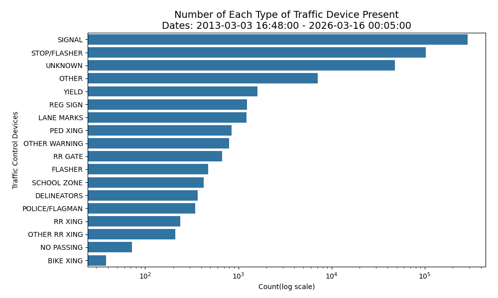
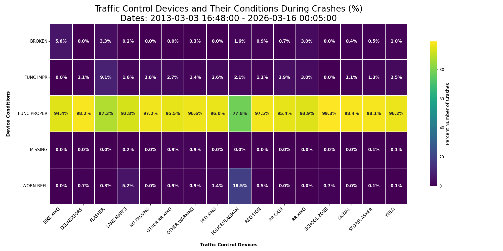
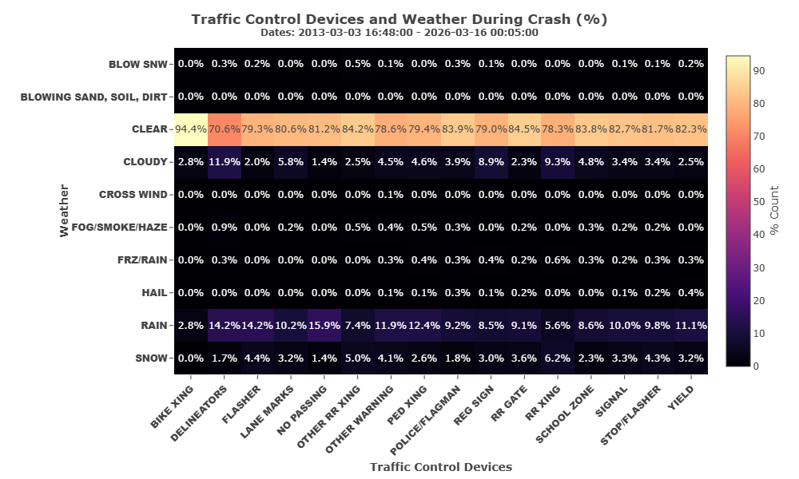
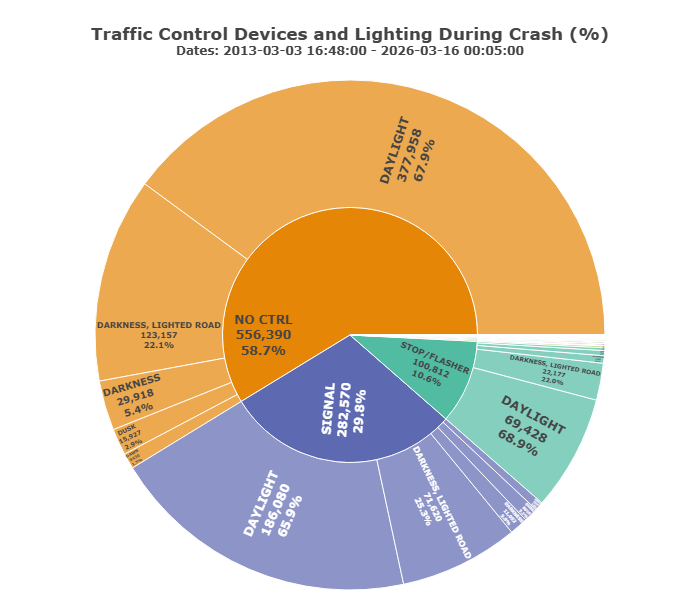
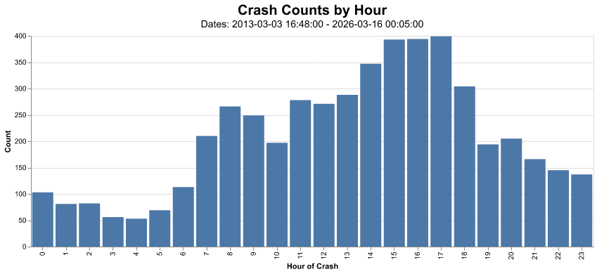
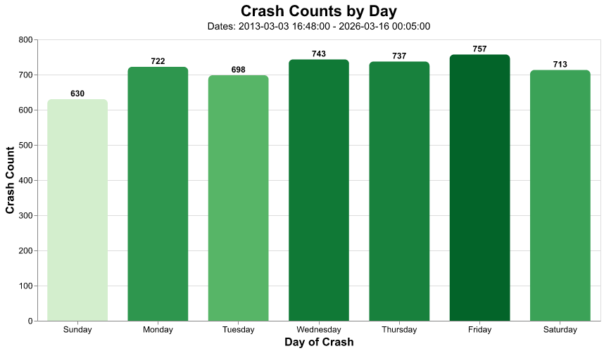
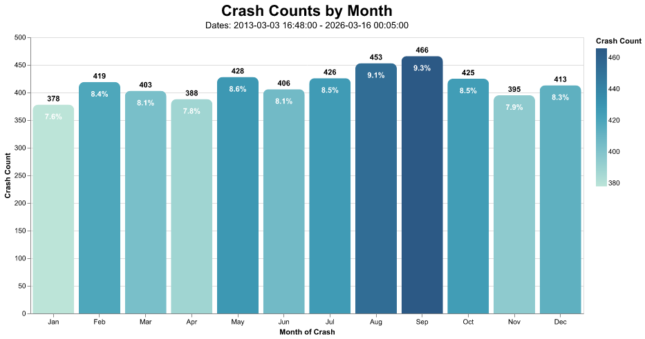
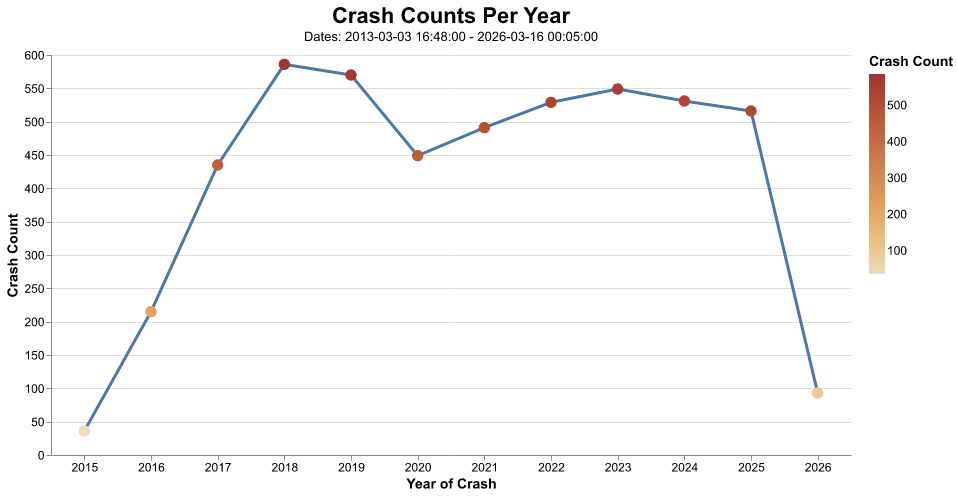
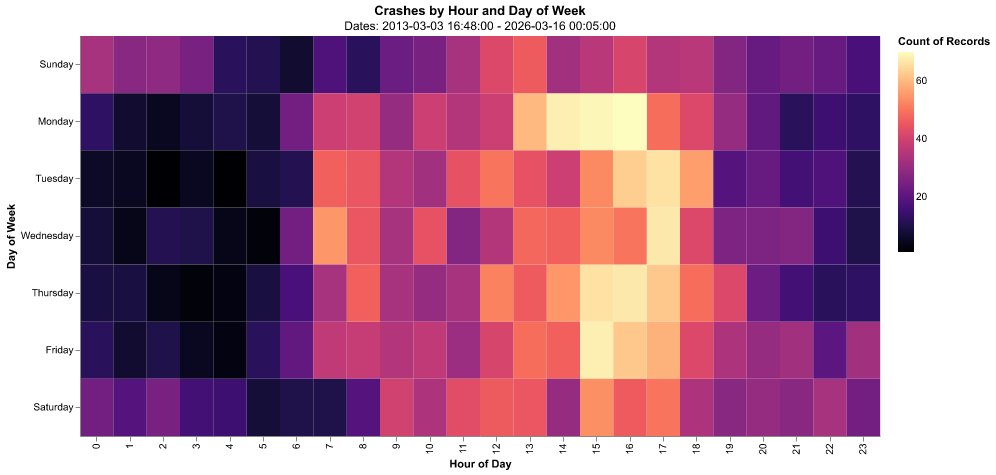

# JAMES SCHOLAR PROJECT CS101  - SPRING 2026


## Overview
Part of the project seeks to determine whether traffic control devices were effective
in deterring traffic accidents in Chicago, which traffic control devices were most effective, and 
whether the traffic device condition, weather, or lighting matters. This part of the project looks at the 
`“TRAFFIC_CONTROL_DEVICE”`,`“DEVICE_CONDITION”`, `"WEATHER_CONDITION"`, and `"LIGHTING_CONDITION"` columns.

Another part of the project does some time analysis on when the crashes occur. This part of the project
looks at the `"CRASH_DAY_OF_WEEK"`, `"CRASH_HOUR"`, `"CRASH_MONTH"`, and `"CRASH_DATE"` columns.

## How to Run
1. Setup virtual environment.
```shell
python -m venv venv
source venv/bin/activate
pip install -r requirements.txt
```

2. Open JSrcommon.ipynb or run 
```shell
python main.py
```

## Conclusions
### Data
Data Conclusions – Chicago traffic crash data is from between dates  March 3, 2013, and March 16, 2026
1. In **4.61%** of cases, there was no report on the presence or absence of traffic control devices.
2. After removing reports of crashes where the presence or absence of traffic control devices is unknown,
**58.9%** of the reported traffic crashes in Chicago occurred in areas without traffic control devices,
compared with **41.1%** in areas with devices.

| Distribution of Crashes | Distribution of Crashes % |
| :---: | :---: |
|  |  |
4. If traffic device signals are present at the crash site, the data show that traffic signals and
stop/flashers are the most common traffic control devices. The logarithmic scale shows that some device
types occur at orders of magnitude more frequently than others.
<p align="center"></p>

4. **Most crashes, where a traffic control device was present, occurred when the traffic control device was
functioning properly!** For example, if a red/green light signal device were present at a site, **98.4%** of the 
accidents at the site occurred when the device was functioning properly. **1.1%** occurred when it 
was functioning improperly. *Are drivers ignoring the traffic control devices? Or do traffic devices cause accidents?*
<p align="center"></p>

5. **Most crashes, where a traffic control device was present, occurred when the weather was
clear!** Rain contributed to a small percentage of accidents. Most other weather conditions (snow, clouds,
winds, hail, etc.) contributed almost nothing to the increase in traffic crashes at the sight of the
traffic control device. For example, when there was a flasher present, 
**79.3%** of crashes occurred when the weather was clear, and **14.2%** occurred when there was rain. 
*Perhaps people are driving more carefully during many weather events or staying home.*
<p align="center"></p>

6. **Examining the top 3 most common traffic control devices (no controls, red/green traffic devices, 
stop/flashing light), most accidents occurred during daylight conditions, or when another source of light
was present.** For example, if no control was present, **67.9%** of crashes occurred during daylight hours,
**22.1%** occurred on a lighted road during darkness, and **5.4%** during darkness on an unlit road. 
Similarly, if a red/green traffic signal was regulating traffic, **65.9%** of crashes occurred within
daylight hours, and **25.3%** during darkness on a lighted road. *Perhaps the amount of traffic during
daylight hours contributes to the increased crash rate.*
<p align="center"></p>

7. Sampling 5000 crash instances, the graph shows that the hours of the highest number of crashes are
5 pm, and then at 3 pm and 4 pm. **The most crashes happened during evening rush hours.** (Please note,
this is a sampling, and each time this data is sampled, the results may vary.)
<p align="center"></p>

8. Sampling 5000 crash instances, the graph shows that the days of the highest number of crashes are 
Fridays. The safest day to travel in Chicago is Sunday. **People are tired at 
the end of the week, rushing home, and causing crashes. To be safe, travel on a Sunday.** (Please note,
this is a sampling, and each time this data is sampled, the results may vary.)
<p align="center"></p>

9. Sampling 5000 crash instances, the graph shows that the months with the highest number of crashes 
are **Sep at 9.3%**, then **Aug at 9.1%**. The lowest number of crashes occurs in **Jan at 7.6%.** This data is not normalized
according to the number of days in the month. (Please note, this is a sampling, and each time this data is sampled, the results may vary.)
<p align="center"></p>

10. Sampling 5000 crash instances, the graph shows that the lowest amount of traffic crashes 
occurred in **2020** during the COVID epidemic. No surprise. The 2nd lowest occurred in 2021 
when some COVID restrictions were still in effect. 2020-2021 was when many people were given 
the opportunity to work remotely. The highest amount of traffic crashes occurred in 2018, followed 
by the 2nd highest in 2019. *Why are 2018 and 2019 such bad years for traffic crashes?* (Please note,
this is a sampling, and each time this data is sampled, the results may vary.)
<p align="center"></p>

11. Sampling 5000 crash instances, our heatmap graph shows that most crashes occur at **16:00/Friday** *(people
rushing home for the weekend)*, then **15:00/Thursday** *(starting to wish for the weekend to come quickly)*.
<p align="center"></p>


### Comments
1. The Seaborn library gives users a lot of control over plotting. However, additional control means that 
there is additional work to make the plot look nice.
2. The Altair plotting library is the easiest to use once users get accustomed to the API. It
centers the graph automatically, eliminating the need for the programmer to run trial-and-error tests.
